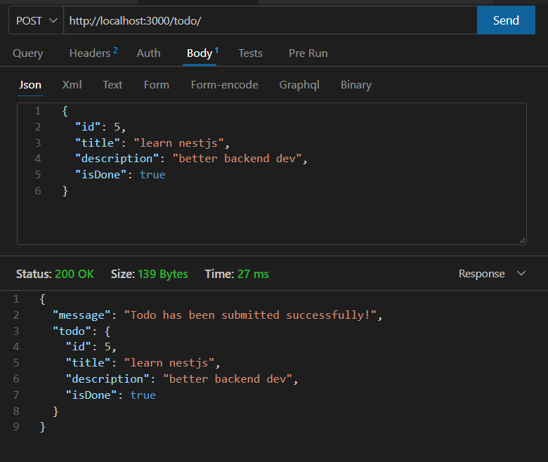
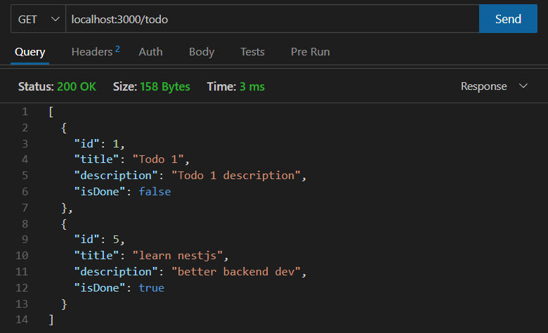

# Todo backend with NestJS Project

A simple project to learn NestJS, a NodeJS framework for building backend applications. This project follows this [guide post](https://masteringbackend.com/posts/nestjs-typescrpt-ultimate-guide). This was not a blind copy-paste project, I tried to understand the concepts and implement the code manually by hand.

The guide post was a very quick hands-on introduction to NestJS. Good for a quick starting point, but very shallow.

## Description

A simple todo backend application with NestJS. It uses a simple in-memory database to store the todo items. The application uses CRUD operations to create, read, update and delete todo items.

## Screenshots

- Creating a todo item


- Listing all todo items



## Installation

```bash
$ npm install
```

## Running the app

```bash
# development
$ npm run start

# watch mode
$ npm run start:dev

# production mode
$ npm run start:prod
```
